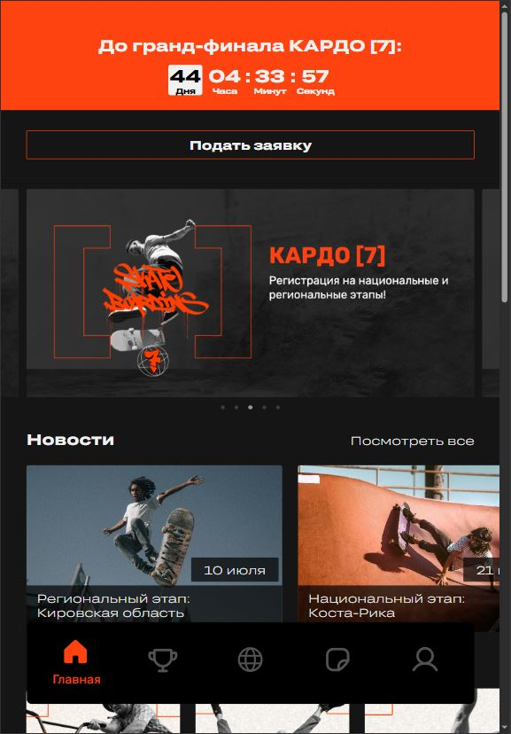

# Проект "Кардо" – MVP мобильного приложения Международной премии

## О проекте

Мобильное приложение "Кардо" — это MVP, разработанный в рамках **Хакатона+ Международной премии КАРДО**. Цель проекта — предоставить удобную платформу для участников, жюри и организаторов премии. Это фронтенд-часть приложения, разработанная командой №2.

## Превью проекта



## Ссылка на демо

- [Перейти к приложению](https://kardo-frontend-zeta.vercel.app/)

## Статус проекта

В рамках хакатона проект завершен. Наша команда заняла **первое место** среди 8 команд.

## Функциональность

- **Адаптивный интерфейс**: Поддержка различных разрешений экрана.
- **Удобная навигация**: Простая структура разделов и пользовательских сценариев.
- **Онбординг**: Экран приветствия и пошаговое знакомство с функциональностью приложения.
- **Личный кабинет**: Возможность просматривать и редактировать информацию.
- **Интеграция с дизайн-системой**: Применение элементов из брендбука и Figma-макетов.
- **Организация по Feature-Sliced Design**: Структурированный подход к разработке.

## Команда проекта

**Команда №2:**

- **Project менеджер** — Надежда Денисова  
- **Product менеджер** — Вероника Кусакина  
- **Дизайнеры** — Анастасия Алексеева, Виктория Аскинази, Ирина Белокрылова  
- **Фронтенд-разработчики** — [Кирилл Беляев](https://github.com/kirill-io), [Иван Чернышев](https://github.com/VanyaGachist2)  
- **Бэкенд-разработчики** — Александр Литвинов, Теймур Османов  
- **QA** — Роман Неклюдов, Елена Смирнова

## Технологии и инструменты

- **HTML5 / CSS3** — Семантическая разметка и стилизация  
- **TypeScript** — Типизированная разработка  
- **React** — UI-библиотека  
- **Redux Toolkit** — Управление состоянием  
- **Webpack** — Сборка проекта  
- **Feature-Sliced Design** — Организация архитектуры  
- **ESLint / Stylelint** — Линтинг кода  
- **Vercel** — Деплой проекта

## Полезные материалы

- [Онбординг](https://norikov.notion.site/568508697c74422d8077142bb7449791)
- [Техническое задание](https://disk.yandex.ru/d/fikfo1dHbaYXIw)
- [Макет в Figma](https://www.figma.com/design/AE3HDcsJW1TVgCAPs41hGM/%D0%9A%D0%90%D0%A0%D0%94%D0%9E?node-id=0-1&t=4d9uFUM08EaUvUH8-0)
- [Доска Miro](https://miro.com/app/board/uXjVK1qJFAA=/)
- [Брендбук и медиа](https://drive.google.com/drive/folders/1r16v19Z-oE0mTDHv948GKLwi9FjuP9l9?usp=drive_link)

## Установка и запуск проекта

1. Клонируйте репозиторий:

   ```bash
   git clone https://github.com/kirill-io/kardo-frontend.git
   ```

2. Перейдите в папку проекта:

   ```bash
   cd kardo-frontend
   ```

3. Установите зависимости:

   ```bash
   npm install
   ```

4. Запустите проект в режиме разработки:

   ```bash
   npm run start
   ```

5. Сборка проекта:

  - Development-версия:

    ```bash
    npm run build:dev
    ```

  - Production-версия:

    ```bash
    npm run build
    ```

## Проверка кода

1. Линтинг TypeScript:

  - Проверка:

    ```bash
    npm run lint:ts
    ```

  - Автоисправление:

    ```bash
    npm run lint:ts:fix
    ```

2. Линтинг CSS:

  - Проверка:

    ```bash
    npm run lint:css
    ```

  - Автоисправление:

    ```bash
    npm run lint:css:fix
    ```
